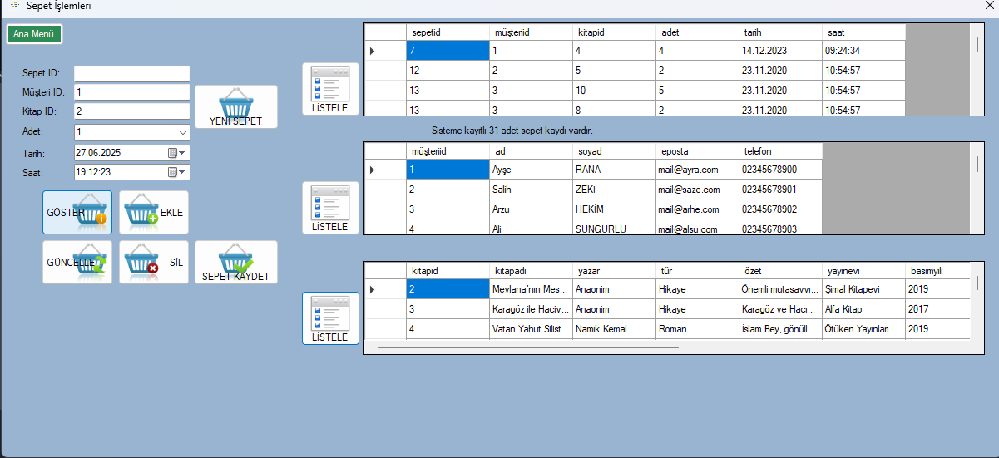

 desktop e-commerce application for basic bookstore management, developed using C# Windows Forms and MySQL database.
C# Windows Forms ve MySQL veritabanı kullanılarak geliştirilmiş basit bir masaüstü kitap satış otomasyon uygulamasıdır.

 Features / Özellikler
 Authentication System / Kimlik Doğrulama Sistemi
User registration and login with email/password
E-posta ve şifre ile kullanıcı kaydı ve girişi

Role-based access control (Admin / Customer)
Rol tabanlı erişim kontrolü (Admin / Müşteri)

 User Management / Kullanıcı Yönetimi
Customer registration and profile management
Müşteri kaydı ve profil yönetimi

 Book Management / Kitap Yönetimi
Complete book inventory system
Kapsamlı kitap envanter sistemi

Add, edit, delete, and search books
Kitap ekleme, düzenleme, silme ve arama

Category and author management
Kategori ve yazar yönetimi

Stock tracking and management
Stok takibi ve yönetimi

🛒 Shopping Experience / Alışveriş Deneyimi
Interactive shopping cart functionality
Etkileşimli sepet fonksiyonu

Add/remove items from cart
Sepete ürün ekleme / çıkarma

Order processing and management
Sipariş işleme ve yönetimi

Sales transaction tracking
Satış işlemlerinin takibi

 Customer Service / Müşteri Hizmetleri
Complaint management
Şikayet yönetimi

 Admin Features / Admin Özellikleri
Sales reporting and analytics
Satış raporlama ve analizleri

Customer management
Müşteri yönetimi

🛠 Technologies Used / Kullanılan Teknolojiler
Programming Language / Programlama Dili: C#

Framework: .NET Framework (Windows Forms)

Database / Veritabanı: MySQL

Architecture / Mimari: Desktop Application / Masaüstü Uygulama

Development Environment / Geliştirme Ortamı: Visual Studio

 Database Structure / Veritabanı Yapısı
The application uses the following main database tables:
Uygulama aşağıdaki ana veritabanı tablolarını kullanır:

Users: User authentication and roles
Kullanıcı doğrulama ve rolleri

Customers: Customer information
Müşteri bilgileri

Books: Book inventory and details
Kitap envanteri ve detayları

Cart: Shopping cart items
Sepet öğeleri

Feedback: Customer feedback and complaints
Müşteri geri bildirimleri ve şikayetleri

## Login Page  

## Homepage  

## Book Page  

## Register Page  

## Cart Page  

## Order Page  

## Customer Panel  

## Admin Panel  

## Statistics  

## Suggestion Page  

